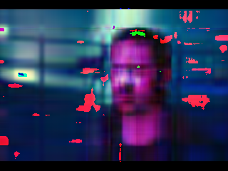

## CLI

Программе передаются следующие аргументы командной строки:

* `--mode=<mode>` – может быть compress или decompress
  * `--mode=compress` – программа преобразует изображение в промежуточное представление
  * `--mode=decompress` – программа восстанавливает изображение из промежуточного представления

* `--method=<method>` (есть, если `--mode=compress`) – задаёт способ сингулярного разложения:
  * `--method=numpy` – для сингулярного разложения используется numpy
  * `--method=simple` – для сингулярного разложения используется примитивный алгоритм
  * `--method=advanced` – для сингулярного разложения используется максимально “хороший” численный метод

* `--compression=<N>` (есть, если `--mode=compress`) – число раз, в которое размер исходного изображения должен быть
  больше размера промежуточного представления: (размер изображения) / (размер пром. представления) >= N

* `--in_file=<path>` – путь до преобразуемого файла
  * Если `--mode=compress` – путь до исходного изображения
  * Если `--mode=decompress` – путь до промежуточного представления

* `--out_file=<path>` – файл с результатом
  * Если `--mode=compress` – файл, в который будет выводиться промежуточное представление
  * Если `--mode=decompress` – файл, в который будет выводиться восстановленное изображение

## Методы

- SVD при помощи библиотеки NumPy

- SVD на основе "Power method"

- SVD на основе метода, использующий преобразование Хаусхолдера

## Эксперимент
Было проведено 12 экспериментов при N = 2:
| Original | NumPy | Simple | Advanced |
| -------|-------|-----------|----------|
|  |  |  |  | 

---------------------
| Original | NumPy | Simple | Advanced |
| -------|-------|-----------|----------|
|  |  |  |  | 

-------------
| Original | NumPy | Simple | Advanced |
| -------|-------|-----------|----------|
|  |  |  |  | 
----------------------

| Original | NumPy | Simple | Advanced |
| -------|-------|-----------|----------|
|  |  |  |  | 
# Вывод
В файле time.txt предоставлены результаты о времени работы алгоритмов для каждой картинки. На основании него можно сделать вывод, что самый долгий оказался Power Method. Он работает во много раз дольше остальных. Самый быстрый оказался библиотечный алгоримт (NumPy). \
На основе исследования можно сказать, что все три алгоритма обеспечивают сопоставимое качество результатов, однако различаются по времени обработки

